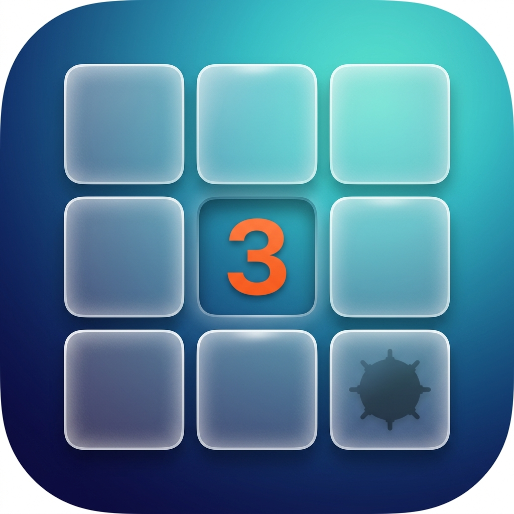
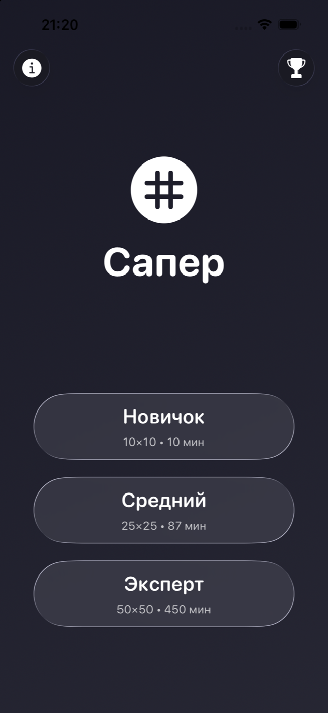
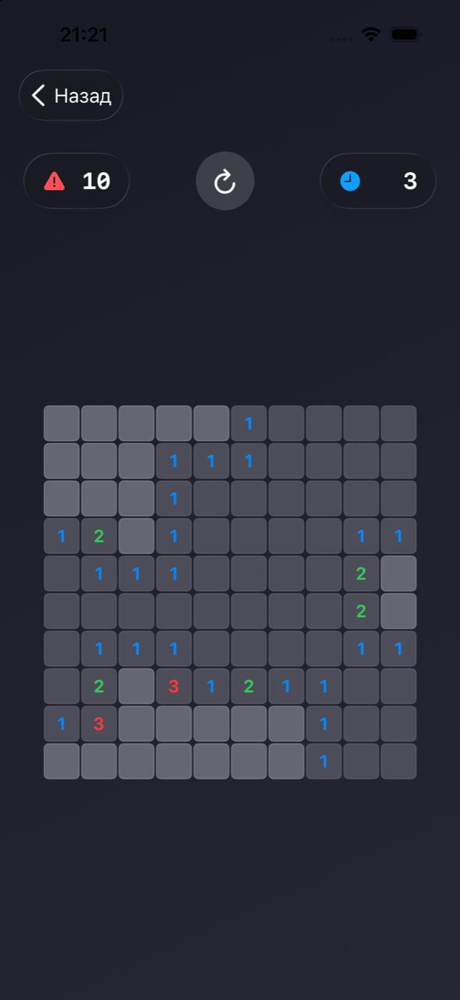
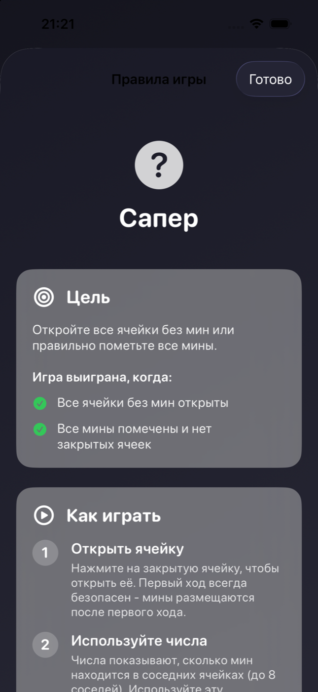
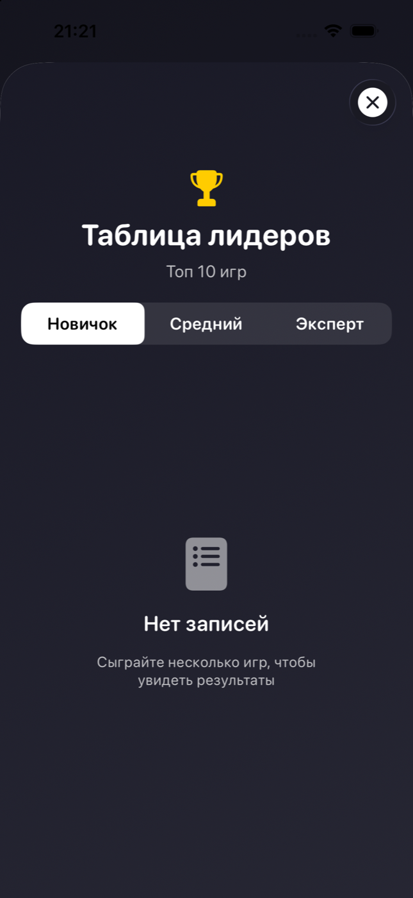

<div align="center">
  

  <h1>MineGrid</h1>

  <p><strong>Современный «Сапёр» для iPhone и iPad — нативный, быстрый и без лишнего.</strong></p>

  <p>
    
    
    
    
  </p>
</div>

MineGrid переосмысливает классическую игру для современного интерфейса Apple. Здесь есть три уровня сложности, безопасный первый ход, автосохранение партии, таблица лучших результатов и аккуратный стеклянный дизайн. Все игровые данные остаются на устройстве — приложению не нужны аккаунт, интернет или сторонние SDK.

## Скриншоты

<table>
  <tr>
    <td align="center">
      <br>
      <sub><b>Главное меню</b></sub>
    </td>
    <td align="center">
      <br>
      <sub><b>Игровой процесс</b></sub>
    </td>
    <td align="center">
      <br>
      <sub><b>Правила и подсказки</b></sub>
    </td>
    <td align="center">
      <br>
      <sub><b>Таблица лидеров</b></sub>
    </td>
  </tr>
</table>

## Что умеет приложение

- 🎯 **Безопасный первый ход** — мины создаются после первого нажатия и не появляются рядом с выбранной ячейкой.
- 🧩 **Три уровня сложности** — от компактного поля для быстрой партии до сетки 50×50.
- 💾 **Автосохранение** — активную игру можно закрыть и продолжить позже.
- 🏆 **Локальная таблица лидеров** — лучшие результаты хранятся отдельно для каждого уровня.
- ⚡️ **Быстрое открытие областей** — итеративный flood fill не блокирует игру на больших полях.
- 📳 **Тактильная обратная связь** — действия сопровождаются нативными haptic-эффектами.
- 🔒 **Приватность по умолчанию** — SwiftData хранит состояние игры и результаты только на устройстве.

## Уровни сложности

| Уровень | Поле | Мины | Плотность |
|:--|--:|--:|--:|
| Новичок | 10 × 10 | 10 | 10% |
| Средний | 25 × 25 | 87 | 14% |
| Эксперт | 50 × 50 | 450 | 18% |

## Как играть

1. Выберите уровень сложности.
2. Нажмите на ячейку, чтобы открыть её — первый ход всегда безопасен.
3. Зажмите закрытую ячейку, чтобы поставить или убрать флаг.
4. Используйте числа: они показывают количество мин в соседних ячейках.
5. Откройте все безопасные ячейки, чтобы победить.

Таймер запускается с первого хода. Количество доступных флагов отображается слева, время партии — справа. Кнопка в центре начинает поле заново.

## Технологии и устройство проекта

- **SwiftUI** — интерфейс и навигация;
- **SwiftData** — сохранённые партии и результаты;
- **Observation / MVVM** — реактивное состояние экранов;
- **Dependency Injection** через протоколы — изоляция игровой логики и сервисов;
- **OSLog** — структурированное логирование;
- **Core Motion** — отладочные жесты в Debug-сборке.

```text
MineGrid/
├── Models/          Игровое поле, ячейки и сохраняемые модели
├── ViewModels/      Состояние партии и таблицы лидеров
├── Views/           SwiftUI-экраны и компоненты
├── Services/        Правила, таймер, сохранение и генерация мин
└── Infrastructure/  Логирование и общие утилиты
```

## Запуск проекта

### Требования

- macOS с Xcode 26.1 или новее;
- iOS / iPadOS 26.1+;
- Swift language mode 5;
- сторонние зависимости не требуются.

### Xcode

```bash
git clone https://github.com/AhmerovDmitry/MineGrid.git
cd MineGrid
open MineGrid.xcodeproj
```

Выберите схему `MineGrid`, подходящий симулятор или устройство и запустите приложение через `⌘R`.

### Проверка сборки из терминала

```bash
xcodebuild -project MineGrid.xcodeproj \
  -scheme MineGrid \
  -configuration Debug \
  -destination 'generic/platform=iOS Simulator' \
  -derivedDataPath /tmp/MineGridDerivedData \
  CODE_SIGNING_ALLOWED=NO build
```

## Документация

- [Архитектура](ARCHITECTURE.md) — слои, потоки данных и инварианты;
- [Тестирование](TESTING.md) — стратегия и обязательная матрица проверок;
- [Безопасность](SECURITY.md) — локальные данные и disclosure;
- [Логирование](LOGGING.md) — устройство и правила логов;
- [План улучшений](IMPROVEMENTS.md) — приоритетные следующие шаги.

---

<div align="center">
  <sub>Сделано на SwiftUI для тех, кто всё ещё считает мины быстрее таймера.</sub>
</div>
